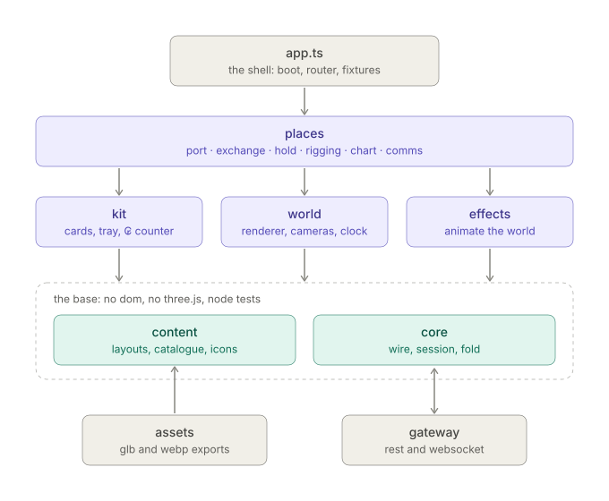
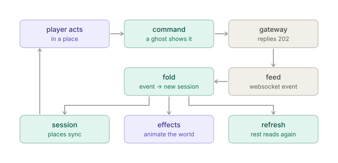
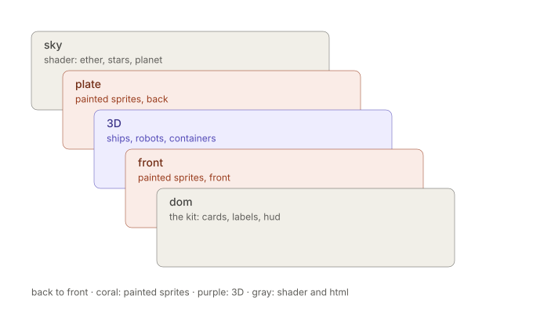

# architecture

the target of the frontend's `painted-art` branch.
the tag `client-v1` keeps the panel client that this branch replaces.
the look is in [game.md](game.md), "the look". the preview in [prototype](../frontend/prototype/) is the
working sketch of this shape.

## the idea

one world, places, cards. a station is a painted scene with a 3D ship
in it. the player acts on things in the scene, and a card opens next to
the thing. the server decides every rule; the client folds the result
in and shows it.

## layers



```text
src/
    core/       the wire and the truth: client, session, fold, transport, validate
    content/    data: station layouts, the model catalogue, goods icons
    world/      one renderer, its layers, cameras, the clock, the asset loader
    places/     port · exchange · hold · rigging · chart · comms · flight · encounter · adrift
    kit/        cards, chips, tray, hold grid, ₢ counter, toasts, hud, console
    effects/    fold → effects → animation
    app.ts      the shell: boot, the place router, the fixture switch
```

the dependency rule: `core` imports nothing above it. `world` and `kit`
import `core` and `content`. `places` import all of them. `effects`
connects `core` to `world`. `core` has no dom and no three.js, so node
tests cover it.

## what stays, what moves

| today | after |
| --- | --- |
| `client.ts`, `session.ts`, `events.ts`, `transport/`, `util.ts` | `core/`, unchanged |
| `maps/chart.ts` (chart geometry, course search) | `core/chart.ts` |
| `simulation/orbit.ts` | `core/orbit.ts`, for the flight place |
| `model.ts` | `content/catalogue.ts` |
| `app.ts` | a new shell |
| `screens/`, `render/`, `components/`, `maps/atlas-*`, `styles/` | replaced by `places/`, `world/`, `kit/` |
| `components/arrival.ts` | `effects/` |

the tests of the core move with it and stay green.

## state

3 states, kept apart:

- **the session**: the server's truth. immutable. only `hydrate()` and
  `fold()` make a new one.
- **the ui state**: what the player does now. the place, the selection,
  a drag, the open card, the ghosts. each place owns its part.
- **the world**: the scene graph. it follows the session and the ui
  state. it is never a source of truth, and it never writes the session.

## the loop



```text
command → 202 → feed → fold → { session, refresh, effects }
                                   │        │        └→ effects animate the world
                                   │        └→ the client reads these again over rest
                                   └→ places sync the ui and the world
```

- **a ghost** shows a command in flight: a pending piece in the hold, a
  module on the hull. the event replaces the ghost. a rejection removes
  it and shows a toast.
- **effects** are small records from `fold`: a wallet change, a fitted
  module, a dock, an arrival, a tow. an effect only animates. it never
  changes state.

## the wire rules

`core` keeps these. the panel clients learned them the hard way.

- **the owner.** the gateway removes the `pid` from another player's
  ship event. an event with our `pid` is ours. never compare `sid`:
  before the first ship, our own `ship.created` looks like a stranger's.
- **deltas.** `cargo.loaded/unloaded` carry the trade delta.
  `wallet.debited/credited` carry the new `balance`. no refetch.
- **numbers.** postgres numerics arrive as strings. the parsers coerce them.
- **no local flips.** a countdown at zero waits for `ship.arrived`.
  the transit start is `arrives` minus the real time of `years_abs`.
- **hops.** `to` is the final stop. ship-service plans the hops. each
  hop arrives as its own departed and arrived pair.
- **in-system routes.** a route with `c < 1` is in-system. the eta uses
  `min(ship velocity, c)`.
- **headroom.** a buy sends `price_unit_max` = price · 1.1, a sell
  `price_unit_min` = price · 0.9. the card shows the plain price.
- **the session.** a 401 logs out. a register 202 gets one delayed login.
  `/me` lags the projection after register, so hydrate retries it.
  a reload in transit counts down from the ship row. logout clears the
  player, or the next player on the tab reads their own ship as a stranger's.
- **reconnect.** backoff `min(1s · 2ⁿ, 10s)`, then hydrate. hydrate
  syncs the traffic again.

## the world ddd



- **one renderer** for the app, so one webgl context. a place mounts its
  layers on enter and unmounts them on leave. it disposes what it made.
- **the layer stack:** the sky (a shader: ether, stars, a turning
  planet) → the plate (painted sprites, back) → 3D (ships, robots,
  containers) → the front sprites → the dom (the kit, labels).
- **cameras:** an orthographic iso camera at 42° azimuth and 29°
  elevation, which matches the painted sprites (port, exchange). an
  orbit camera (rigging, chart). the flight camera.
- **anchors:** a world point maps to a screen point each frame. labels,
  hotspots and cards follow it.
- **the clock:** one frame loop. it stops when the page is hidden. with
  reduced motion, flows keep their time and ambient motion stops.
- **the loader:** glb and webp by content id, with a cache and progress.
  an instance clones the geometry and shares the materials. on load, a
  paint pass gives every mesh the toon light, the outline and the grime.

## content

- **a station layout** (json, one per station): the plate sprites with
  position, width, anchor and order; the deck plane (origin and scale),
  so 3D objects stand on the painting; the hotspots and the place each
  one opens; the paths of the robots.
- **the model catalogue** (json): each hull with its glb, sockets, scale
  and floor; each module design id with its glb; npc ships, robots,
  containers.
- **the art** lives in `~/Work/theseus/assets`: the painted plates and
  icons, and `blender/` with the model sources and their build scripts.
  a sync step copies the exports into `public/`. the client repo holds
  exports only.

## places

a place has 3 parts: `enter(stage, session)`, `sync(session, ui)` and
`leave()`, and its kit.

| place | does | commands |
| --- | --- | --- |
| port | the home: the station, the ship on its pad, robots, hotspots | travel |
| exchange | the market tray; drag a good into the hold, a piece out | buy, sell |
| hold | the cargo grid; move and rotate pieces | arrange (asked) |
| rigging | the blueprint, the ship, its slots, the yard's stock | preview, install, remove, rename |
| chart | the stars in 3D, routes, light years or ship years | travel |
| comms | letters and the station channel | send |
| flight, encounter, adrift | later | later |

## the kit

lit elements, styled from the tokens: a card that opens next to an
anchor, chips, the tray, the hold grid, the ₢ counter that runs green
and red, toasts, the hud, and the console drawer on the backtick key.
every action has a keyboard path. a scene pick is a shortcut, not the
only way.

## fixture mode

`?fixture=<name>` boots the client on a recorded session, with no
gateway. a command resolves with scripted events. it serves art and
layout work, and screenshot checks.

## validation

`npm run check` stays. the tests:

- the core, as today: the parsers, the fold, the eta, pending commands,
  the chart.
- the content: layouts and the catalogue against the asset files.
- effects: which frame gives which effect.
- the hold: packing, rotation, the hauling classes.
- later: screenshots of each place on its fixture.

## order

1. the skeleton: move the core, empty `world/`, `places/`, `kit/`, the
   fixture mode. the tests stay green.
2. `world/` and the port, on a fixture.
3. exchange and hold, rigging, the chart, comms.
4. flight, encounter, adrift.
5. remove the old code.

## open ideas

from the panel clients, not built:

- **the ship card.** in transit: the eta, from, to, the speed in c and
  km/s, a ΔV graph and a transit bar. docked: the arrival time, the
  origin, ship years and galaxy years, the hops.
- **the chart.** inside a system, hide the interstellar routes. a docked
  ship is not a dot: the station lists its pilots.
- **the ledger.** a balance column.
- **the feed.** one line with the last event. a click opens the table:
  event, command, details.
- **the login.** no uppercase transform on the inputs. a show-password button.

## asked of the server

- a cell position on each cargo piece, auto-pack on load, and a
  `cargo.arrange` command.
- a tug service: a price, a tow time, payment in kind.
- x, y, z per system in `/api/universe`.
- a `destination` on the ship row, so a reload keeps the course.


